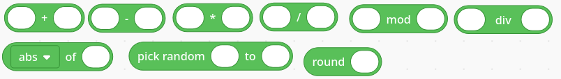
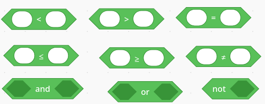
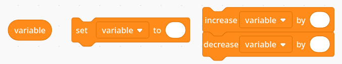
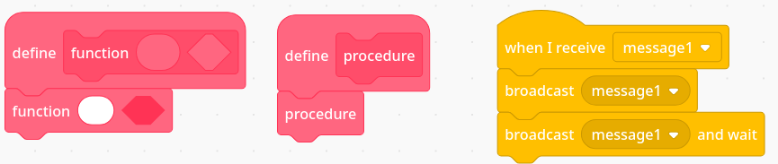
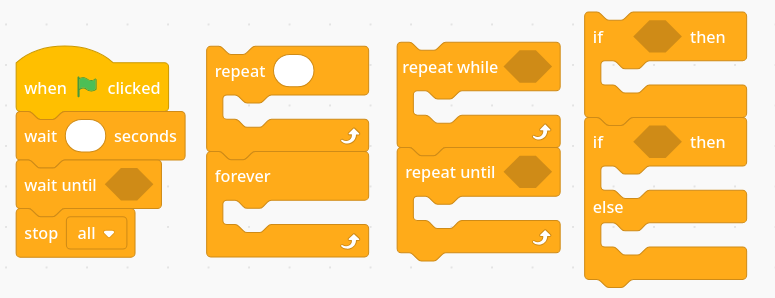

# Blocks
All blocks are subject to change: ANY CHANGES MADE NEEDS TO BE COMMUNICATED WITH GROUP.

## Expression Types
* Numerical expressions
* Boolean expressions
* Cryptocurrencies

## Currency Expressions
* A drop down menu of currencies, you should be able to get a list from the backend in the future.

## Numerical Types
* User can create *numerical expression* +,-,/,\*,mod,div *numerical expression* expressions.
* User can create mathematical function of *numerical expression* expressions.
* Functions could include abs, floor, ceiling, sqrt, sin, cos, tan, asin, acos, atan, ln.
* User can create pick random from *numerical expression* to *numerical expression*.
* User can create round *numerical expression* expressions.

## Boolean Expressions
* User can create *numerical expression* >,<,≥,≤,=,≠ *numerical expression* expressions.
* User can create *boolean expression* or, and *boolean expression* expressions.
* User can create not *boolean expression* expressions.

## Variables
* User can create global variables.
* Variables have a default value of 0.0
* User can set the value of a variable to *numerical expression*.
* User can increase the value of a variable by *numerical expression*.
* User can decrease the value of a variable by *numerical expression*.

## Functions
* USERS SHOULD BE ABLE TO CHANGE HOW MANY PARAMETERS THERE ARE
* User can create functional blocks.
* User can call functional blocks.
* (Low-Priority) User can create a-sync functions.
* (Low-Priority) User can call a-sync functions.
* (Low-Priority) User can call await a-sync functions.

## Control Flow
* User can create on start header block.
* User can create a stop footer block.
* User can create a repeat for *numerical expression* loop.
* User can create a repeat while *boolean expression* loop.
* User can create a repeat until *boolean expression* loop.
* User can create a repeat forever loop.
* User can create a loop for all currencies, which adds a local cryptocurrency variable for use within the loop.
* User can create a wait for *numerical expression*.
* (Low-Priority) User can create a wait until *boolean expression*.
* User can create if-then block.
* User can create if-then-else block.

## Trade Flow
* User can get price of currency.
* User can get price of currency *numerical expression* (seconds, minutes, hours, days, weeks) ago.
* User can buy *numerical expression* of *currency*.
* User can sell *numerical expression* of *currency*.
* User can get amount owned of a currency.
* User can get amount of virtual currency owned.
